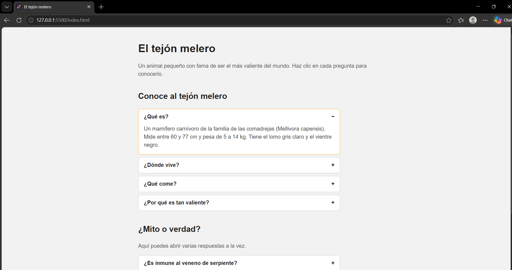
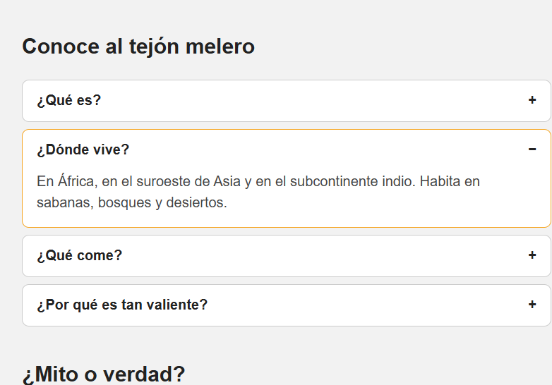
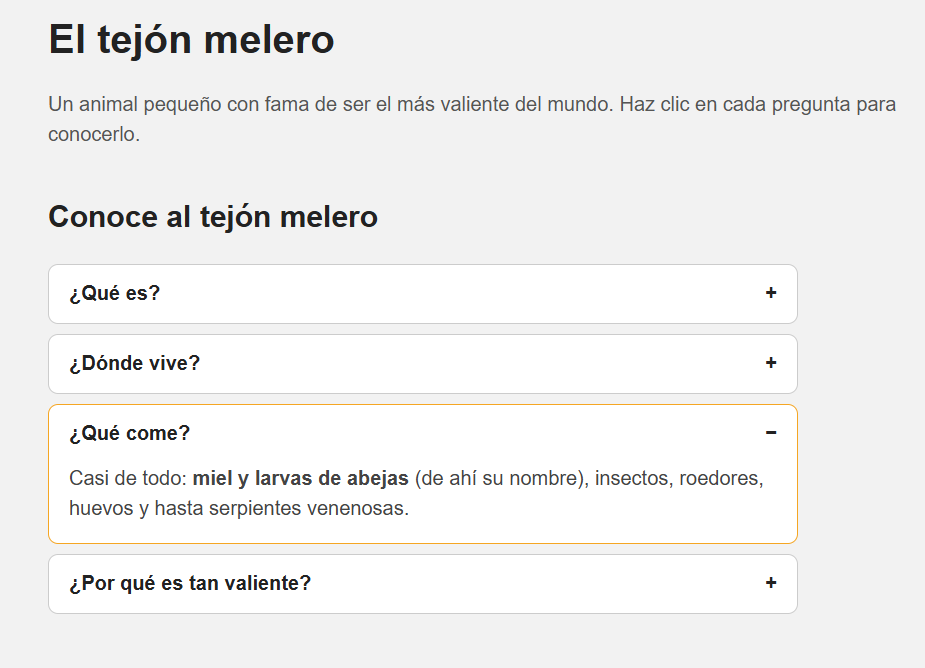

<p align="center">
  <b>TECNOLÓGICO NACIONAL DE MÉXICO</b><br>
  <b>INSTITUTO TECNOLÓGICO DE OAXACA</b>
</p>

<p align="center">
  Carrera: Ingeniería en sistemas computacionales<br>
  Materia: Programación web<br>
  Docente: Adelina Martinez<br>
  Alumno: Cortés Cruz Jesús<br>
  Número de control: 23160870<br>
</p>

---

<h1 align="center">Mosaico Acordeón</h1>

<p align="center">
  <b>Un acordeón reutilizable en JavaScript puro.</b><br>
  Tú pasas los títulos y el contenido, él crea el HTML y se encarga de abrir y cerrar.
</p>

## Nombre del componente

**Mosaico Acordeón** (`Mosaico.accordion()`), un componente visual interactivo hecho con HTML, CSS y JavaScript, sin frameworks ni dependencias. La demo usa como ejemplo al **tejón melero**.

## ¿Qué problema resuelve?

Cuando una página tiene mucha información , mostrarla toda junta la vuelve larga y difícil de leer. Las personas se pierden y tienen que hacer scroll para encontrar lo que buscan.

Un acordeón resuelve eso: muestra solo los títulos y deja abrir únicamente lo que interesa. Pero escribir ese comportamiento desde cero en cada proyecto es repetitivo, con HTML, CSS y JS distinto cada vez.

**Mosaico Acordeón lo resuelve con una sola llamada:** le pasas una lista de `{ title, content }` y te dibuja el componente completo.

```js
Mosaico.accordion('#faq', [
  { title: '¿Qué es?', content: 'Un mamífero carnívoro.', open: true },
  { title: '¿Dónde vive?', content: 'En África y Asia.' }
]);
```

| Sin la librería | Con Mosaico Acordeón |
|---|---|
| Copiar y pegar HTML, CSS y JS en cada proyecto | Una llamada con tu contenido |
| Contenido escrito a mano dentro del HTML | Contenido dinámico desde un arreglo |
| Comportamiento distinto en cada página | Mismo comportamiento y aspecto en todas |

## Características

- Reutilizable: el contenido, el orden y el comportamiento se pasan como parámetros
- Modo de una sección abierta a la vez, o varias con `multiple: true`
- Evento `onToggle` para saber qué se abrió o cerró
- Funciona con teclado y usa `aria-expanded`
- Un solo CSS y un solo JS

## Instalación

Copia las carpetas `css/` y `js/` a tu proyecto e incluye los archivos en tu HTML:

```html
<link rel="stylesheet" href="css/componente.css">
<script src="js/componente.js"></script>
```

Al cargar el script queda disponible el objeto global `Mosaico`.

> El componente solo necesita `componente.css` y `componente.js`. El archivo `js/app.js` es únicamente el ejemplo de uso (el contenido del tejón melero), y en `componente.css` la sección "Estilos de la página" es solo la decoración de la demo.

## Uso

### 1. Crea un contenedor vacío en tu HTML

```html
<div id="faq"></div>
```

### 2. Llama al componente con tu contenido

```html
<script src="js/componente.js"></script>
<script>
  Mosaico.accordion('#faq', [
    { title: '¿Qué es?', content: 'Un mamífero carnívoro.', open: true },
    { title: '¿Dónde vive?', content: 'En África y Asia.' },
    { title: '¿Qué come?', content: 'Miel, insectos y <b>serpientes</b>.' }
  ]);
</script>
```

### 3. Reutilízalo con otro contenido y otras opciones

```js
Mosaico.accordion('#mitos', [
  { title: '¿Es inmune al veneno?', content: 'Casi, pero no del todo.' },
  { title: '¿Es el más valiente?', content: 'Verdad, según los récords mundiales.' }
], {
  multiple: true,
  onToggle: function (info) { console.log('Mitos:', info); }
});
```

Es el mismo componente con distinto contenido y comportamiento: el primero deja una sección abierta a la vez y el segundo permite varias.

## Parámetros

`Mosaico.accordion(contenedor, items, opciones)`

| Parámetro | Tipo | Descripción |
|---|---|---|
| `contenedor` | string o elemento | Selector CSS (`'#faq'`) o un elemento del DOM donde se dibuja |
| `items` | array | Lista de secciones (ver abajo) |
| `opciones` | object | Opcional (ver abajo) |

**Cada elemento de `items`:**

| Propiedad | Tipo | Descripción |
|---|---|---|
| `title` | string | Texto del botón |
| `content` | string | Contenido del panel (acepta HTML) |
| `open` | boolean | Si es `true`, inicia abierta |

**`opciones`:**

| Opción | Tipo | Por defecto | Descripción |
|---|---|---|---|
| `multiple` | boolean | `false` | `true` permite varias secciones abiertas a la vez |
| `onToggle` | function | — | Se ejecuta al abrir o cerrar y recibe `{ index, title, open }` |

> **Advertencia:** `content` se inserta como HTML. Si el texto lo escriben usuarios, no lo pases directo, para evitar problemas de seguridad.

## Capturas de pantalla

**Componente funcionando:**






## Video demo

[Ver video (máx. 1 min)](img/videoComponentevisual.mp4)

## Estructura del proyecto

```
├── index.html
├── README.md
├── css/
│   └── componente.css    <- estilos del acordeón
├── js/
│   ├── componente.js     <- la librería
│   └── app.js            <- ejemplo de uso (tejón melero)
└── img/
    ├─
    ├── captura-acordeon.png
    └── captura-consola.png
```

